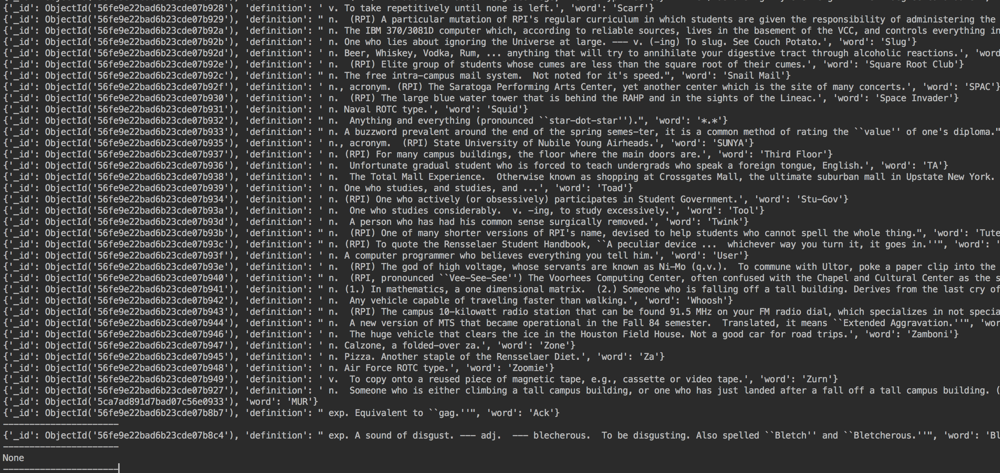

# Lab 10 

### Checkpoint 1

### Checkpoint 2

### Checkpoint 3

Part 1:

> db.definitions.find()

It returns a list of cursor to the selected documents(everything in this case).  

> db.definitions.findOne()

It returns one document that satisfies the specified query criteria on our collection. 

> db.definitions.find({word: "Capitaland"}) 

It returns a cursor to the document with the word "Capitaland".

> db.definitions.find({_id: ObjectId("56fe9e22bad6b23cde07b8ce")})

It returns a cursor to the document with given id.

Part 2:

I made too much unsuccessful attempts so I could not find the record I entered and the record I changed.

But I can provide a git diff:

### Checkpoint 4

### Checkpoint 5

