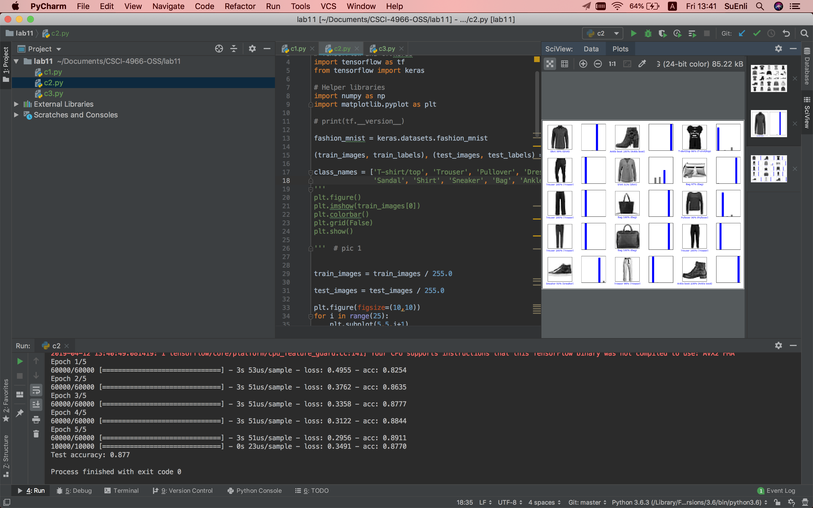
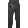
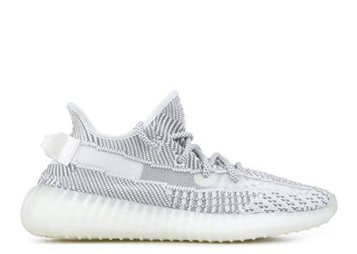

# Lab 11

### Checkpoint 1

I got everything imported quite easily.

### Checkpoint 2

As a OSX user, I got an error saying:  
ssl.SSLError: [SSL: CERTIFICATE_VERIFY_FAILED] certificate verify failed (_ssl.c:749)  

What I did was:  
bash $ cd Applications/Python\ 3.6  
bash $ sudo ./Install\ Certificates.command

And It worked.

I would recommend this fix to all future OSX user using Python 3.6 for this lab.

Reference: https://stackoverflow.com/questions/41691327/ssl-sslerror-ssl-certificate-verify-failed-certificate-verify-failed-ssl-c

### Checkpoint 3

Ponto (pants):  

Lo (dress): 

Yeezy (I really don't know):
It should be a sneaker.

