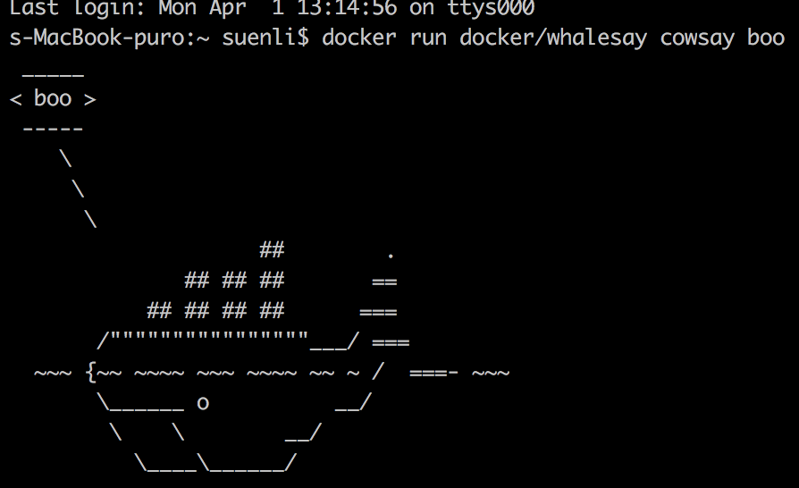
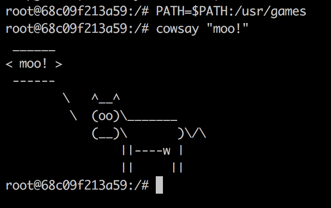
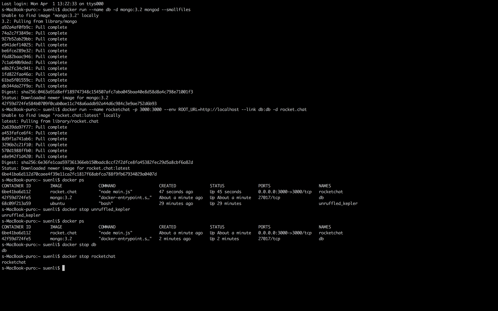
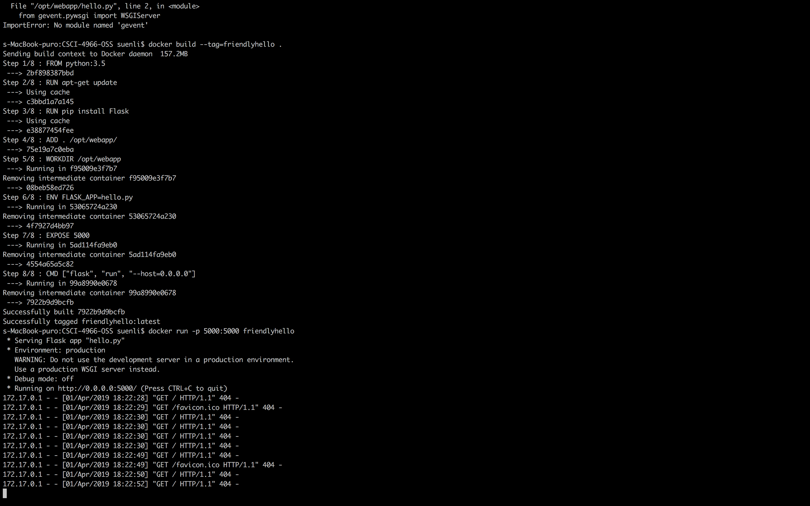
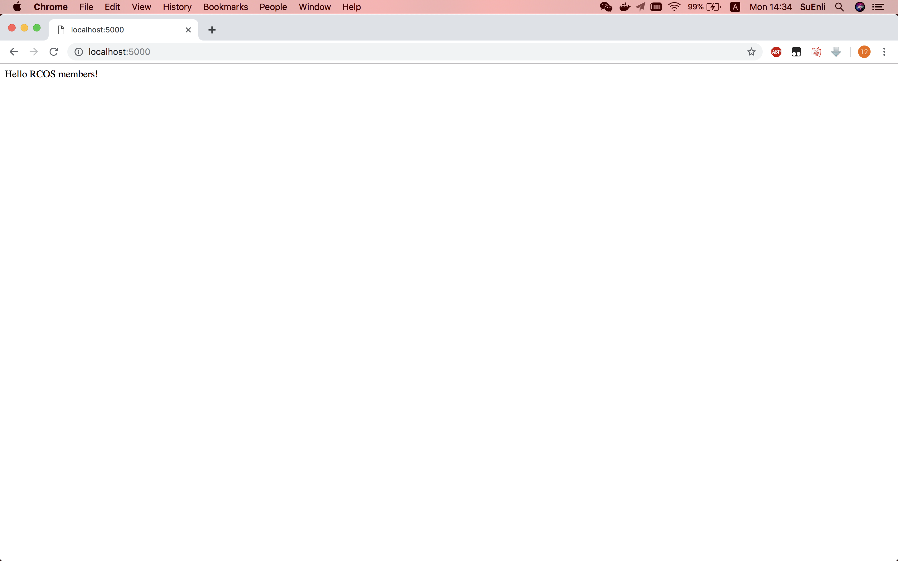
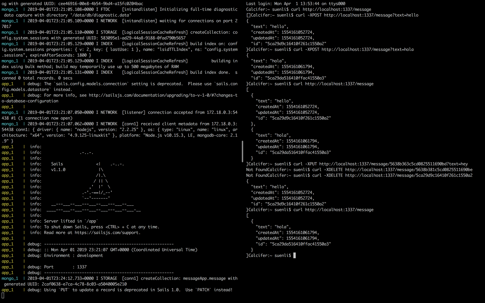

# Lab 9 

I almost screwed this up by doing a "git revert".  
Luckily I can still "git cherry-pick".

### Example 00  

Boo

----

### Example 01

Command cowsay is not in /bin or usr/bin.  
Therefore, I had to export the path in terminal before executing cowsay "moo!".

----

### Example 02  

----

### Example 03  

----

### Example 04  

